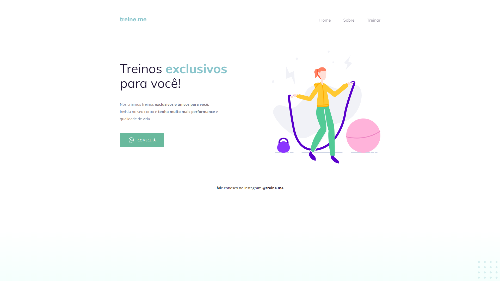
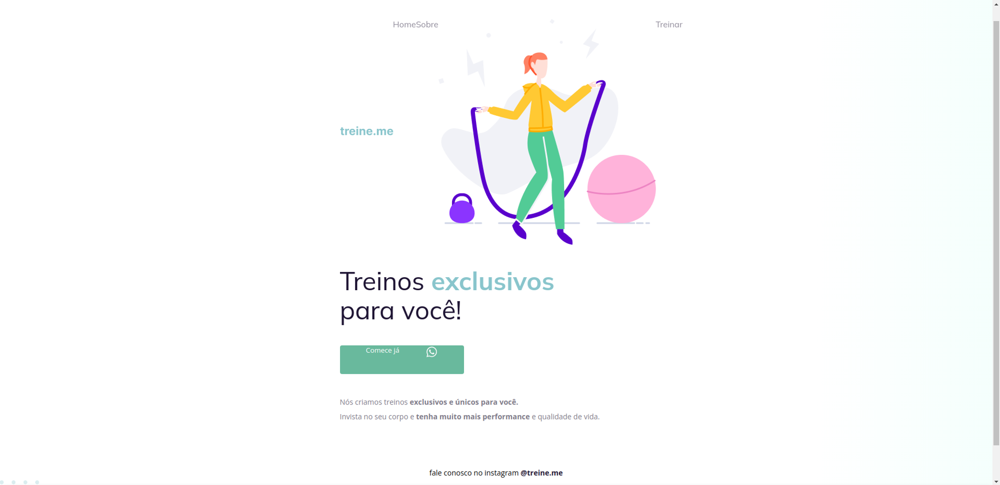

<h1 align="center"> Desafio Iniciante - Corrigindo Bugs 02</h1>

  <a href="#-tecnologias">Tecnologias</a>&nbsp;&nbsp;&nbsp;|&nbsp;&nbsp;&nbsp;
  <a href="#-projeto">Projeto</a>&nbsp;&nbsp;&nbsp;|&nbsp;&nbsp;&nbsp;
  <a href="#-layout">Layout</a>&nbsp;&nbsp;&nbsp;

 

  

## 🚀 Tecnologias

Esse projeto foi desenvolvido com as seguintes tecnologias:

- HTML e CSS
- Git e Github
- Figma

## 💻 Projeto

Nesse desafio foi recebido um código com o projeto desenvolvido durante as aulas da Fase 02 do programa Explorer da RocketSeat.
O código sofreu algumas alterações, como podemos ver na imagem abaixo: 

  

 

O desafio foi deixar o site como está no layout figma.

## 🔖 Layout

Você pode visualizar o layout do projeto através [DESSE LINK](https://www.figma.com/file/rkDOHGPwwFtBNqEdHSuQPd/Projeto-02---Explorer?node-id=23%3A1928&t=xFdBmEBZavkRWatz-0). É necessário ter conta no [Figma](https://figma.com) para acessá-lo.

---
